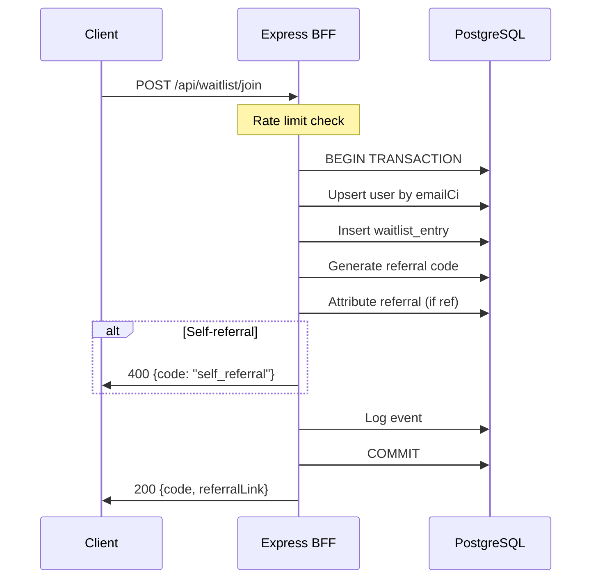
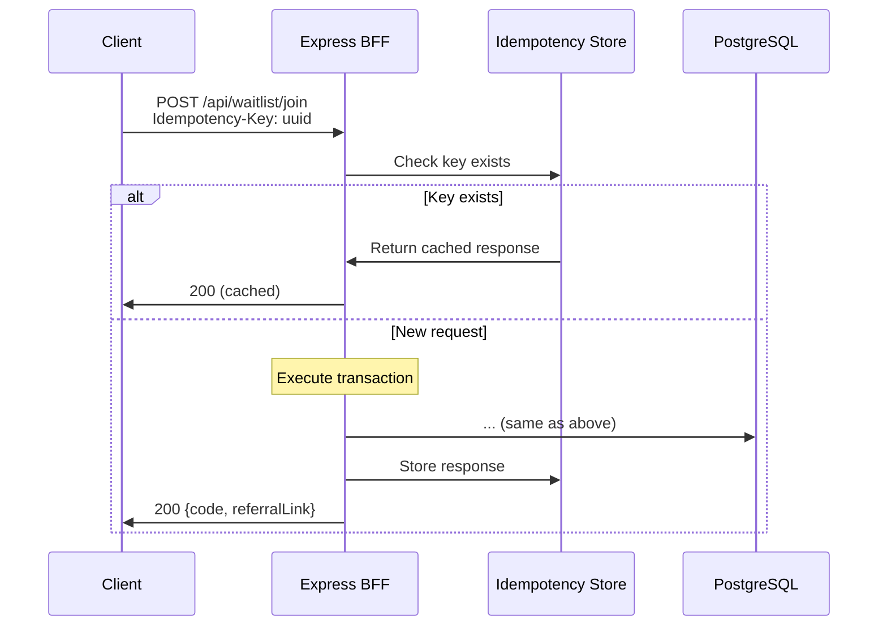

# Architecture Review - GoAmpy Waitlist System
**Date:** November 14, 2025  
**Architect:** Onboarding Review  
**Repo:** https://github.com/karlnewlin1/GoAmpyWaitlist-2

---

## Executive Summary

GoAmpy is a well-architected waitlist application with solid foundations in Feature-Sliced Design (FSD), security practices, and PWA capabilities. This review identifies **hardening opportunities** across three key areas that will move the system from "good" to "production-ready best-in-class."

**Status:** 🟡 **Good foundation, needs hardening**

---

## Current State Assessment

### ✅ Strengths

1. **Architecture**
   - Clean FSD implementation on frontend (`/app` → `/pages` → `/features` → `/shared`)
   - Proper BFF pattern with services layer
   - Good separation of concerns

2. **Security Baseline**
   - Helmet.js configured (CSP disabled appropriately)
   - CORS middleware in place
   - Rate limiting on join and auth endpoints
   - Pino logging with some PII redaction
   - Trust proxy enabled for accurate IP tracking

3. **Data Integrity**
   - Strong referral code generation (slugified username + nanoid)
   - Self-referral prevention in place
   - Transaction-based join flow
   - Unique constraints and indexes

4. **Progressive Web App**
   - PWA plugin configured
   - Service worker auto-update
   - Manifest with proper icons
   - Offline-capable architecture

### ⚠️ Critical Gaps (Blocking Production)

#### Security & Reliability (PR-A)

1. **Incomplete PII Redaction**
   ```typescript
   // Current: Missing cookie, token, res.body
   redact: ['req.headers.authorization', 'req.body.email', 'req.body.password', 'req.body.name', 'res.body']
   ```
   - ❌ `req.headers.cookie` not redacted (session tokens)
   - ❌ `req.body.token` not redacted (OTP verification)
   - ❌ Response bodies logged in production (PII leak risk)

2. **CORS Configuration Issue**
   ```typescript
   // Current: credentials: true with empty origin list
   origin: origins && origins.length > 0 ? origins : true
   ```
   - ❌ Falls back to `true` (allows any origin) if `APP_ORIGIN` not set
   - ⚠️ This is a **critical security vulnerability** in production

3. **Missing Rate Limiting**
   - ❌ `/r/:code` has NO rate limit (DoS vector)
   - ✅ Join and auth properly limited
   - **Impact:** Attackers can flood referral tracking

4. **No Idempotency Enforcement**
   - Current join is naturally idempotent via DB constraints
   - ❌ No `Idempotency-Key` header support
   - ❌ Client could retry on timeout and create race conditions

5. **Health Check Issues**
   ```typescript
   version: ENV.GIT_SHA  // Defaults to 'dev'
   ```
   - ❌ No actual git SHA capture in build process
   - Makes debugging production issues difficult

#### Native PWA Feel (PR-B)

1. **Missing iOS PWA Meta Tags**
   ```html
   <!-- Missing from index.html -->
   <meta name="apple-mobile-web-app-capable" content="yes">
   <meta name="apple-mobile-web-app-status-bar-style" content="black-translucent">
   <link rel="apple-touch-icon" href="/apple-touch-icon.png">
   ```

2. **Web Share API Not Implemented**
   - No native share button in referral feature
   - Missing clipboard fallback
   - Reduces viral coefficient significantly

3. **Share Page Optimization**
   - ✅ OG tags present
   - ✅ Cache-Control set to 600s
   - ⚠️ Image URL hardcoded to `goampy.com` (breaks in dev)

#### API Contract (PR-C)

1. **No OpenAPI Specification**
   - No `docs/api/openapi.yaml`
   - Makes integration difficult
   - No API documentation site

2. **Error Taxonomy Not Standardized**
   ```typescript
   // Current: Ad-hoc error codes
   'disposable_email_not_allowed'
   'self_referral'
   // Need: Standardized schema with versioning
   ```

3. **Missing API Documentation Endpoint**
   - No `/api/docs` Redoc integration
   - Developers must read code to understand API

---

## Deliverables Plan

### PR-A: Security & Reliability

**Files Modified:**
- `server/src/middleware/logger.ts` - Enhanced redaction
- `server/src/middleware/cors.ts` - Strict allowlist
- `server/src/middleware/rateLimit.ts` - Add referral limiter
- `server/src/routes/redirects.ts` - Apply rate limiting
- `server/src/routes/waitlist.ts` - Idempotency-Key support
- `server/src/routes/health.ts` - Add git SHA from env
- `package.json` - Add build script for SHA capture

**Changes:**
1. Pino redaction: Add `cookie`, `token`, `res.body` with conditional removal in prod
2. CORS: Remove fallback to `true`, require explicit `APP_ORIGIN`
3. Rate limit: Add `/r/:code` → 100 req/15min per IP
4. Idempotency: Check `Idempotency-Key` header, return 409 on duplicate
5. Health: Capture `GIT_SHA` during build, include in response

**Testing:**
- [ ] Verify PII not in logs (Authorization, Cookie, email, token)
- [ ] Test CORS rejection without APP_ORIGIN
- [ ] Load test /r/:code hits rate limit
- [ ] Verify Idempotency-Key prevents duplicate joins
- [ ] Confirm health returns real git SHA

### PR-B: Native PWA Feel & Sharing

**Files Modified:**
- `client/index.html` - iOS meta tags
- `client/src/features/referral/components/ReferralCard.tsx` - Web Share API
- `client/public/apple-touch-icon.png` - New asset (180x180)
- `server/src/routes/share.ts` - Dynamic OG image URL

**Changes:**
1. Add iOS PWA meta tags for home screen installation
2. Implement Web Share API with clipboard fallback
3. Add toast notification for "Link copied"
4. Use `req.protocol + req.get('host')` for OG image URL
5. Test share flow on iOS Safari and Android Chrome

**Testing:**
- [ ] iOS: Add to Home Screen works
- [ ] iOS: Status bar styled correctly
- [ ] Android: Install prompt appears
- [ ] Share button uses native share on mobile
- [ ] Clipboard fallback on desktop
- [ ] Share link preview looks good on LinkedIn/Twitter

### PR-C: OpenAPI Contract & Documentation

**Files Created:**
- `docs/api/openapi.yaml` - Full OpenAPI 3.1 spec
- `docs/api/README.md` - Link to Redoc
- `server/src/routes/docs.ts` - Redoc endpoint

**Files Modified:**
- `server/src/app.ts` - Mount `/api/docs` in dev only
- `docs/api/http-contract.md` - Reference OpenAPI spec

**Specification Includes:**
1. All endpoints with request/response examples
2. Error taxonomy with stable codes
3. Rate limit headers (`X-RateLimit-*`)
4. Idempotency patterns
5. Authentication flows (OTP)
6. Referral attribution
7. Health check schema

**Error Taxonomy:**
```yaml
errors:
  - code: "validation_error"
  - code: "disposable_email"
  - code: "self_referral"
  - code: "rate_limit_exceeded"
  - code: "duplicate_request"
  - code: "not_found"
  - code: "internal_error"
```

---

## Security Hardening Checklist

### Server

- [x] Helmet configured (CSP off)
- [ ] **CORS strict allowlist** (currently falls back to `true`)
- [x] Trust proxy enabled
- [ ] **Pino redaction complete** (missing cookie, token, res.body)
- [x] Rate limits on join/OTP
- [ ] **Rate limit on /r/:code** (DoS vector)
- [x] Join is transactional
- [x] Self-referral blocked
- [ ] **Idempotency-Key enforcement** (not implemented)
- [x] Unique indexes verified
- [ ] **Health check includes git SHA** (defaults to 'dev')

### Client (FSD + Atomic)

- [x] FSD structure maintained
- [x] No cross-feature imports
- [x] Landing/Tour/Dashboard match UX contract
- [ ] **PWA iOS meta tags** (missing)
- [ ] **Web Share API** (not implemented)
- [x] Accessibility: Basic support
- [ ] **a11y: aria-live, focus traps** (needs audit)

### Docs & Tests

- [ ] **OpenAPI spec** (does not exist)
- [ ] **API docs endpoint** (not configured)
- [ ] **Vitest tests** (not present)
- [ ] **Playwright E2E** (not present)

---

## Data Flow Analysis

### Current Join Flow ✅ (Correct)


### Proposed Enhanced Flow with Idempotency


---

## Risk Assessment

### High Priority (Block Production)
1. **CORS Vulnerability** - Any origin allowed if `APP_ORIGIN` unset
2. **PII Leakage** - Cookies and tokens logged
3. **DoS Vector** - No rate limit on `/r/:code`

### Medium Priority (Harden Soon)
1. **Idempotency** - Network retries could cause issues
2. **Missing Tests** - No safety net for changes
3. **Health Check** - Can't identify deployed version

### Low Priority (Nice to Have)
1. **OpenAPI Spec** - Improves DX
2. **PWA Polish** - iOS home screen support
3. **Web Share API** - Increases virality

---

## Next Steps & Recommendations

### Immediate (This Sprint)
1. ✅ **This Review** - Validate findings with product owner
2. 🔄 **PR-A** - Security hardening (2-3 days)
3. 🔄 **PR-B** - PWA enhancements (1-2 days)
4. 🔄 **PR-C** - OpenAPI spec (1-2 days)

### Short Term (Next Sprint)
1. Add Vitest unit tests for services
2. Add Supertest integration tests
3. Add 1 Playwright smoke test (Landing → Dashboard)
4. Set up Sentry error tracking

### Medium Term (Q1 2026)
1. Add Redis for distributed rate limiting
2. Implement read replicas for scaling
3. Add WebSocket support for real-time updates
4. Create admin dashboard

### Technical Debt
1. **Session Management** - Currently using lightweight custom session, should migrate to express-session with Redis store
2. **Email Verification** - Supabase OTP partially implemented but not tested
3. **Disposable Email List** - Hardcoded regex should use service like disposable-email-domains
4. **Monitoring** - Need structured logging, metrics, and alerts

---

## Decision Log

### ADR-003: Rate Limiting Strategy
**Context:** Need to prevent abuse while allowing legitimate traffic  
**Decision:** Use in-memory rate limiting (express-rate-limit) for MVP, migrate to Redis for multi-instance  
**Consequences:** Single instance limitation acceptable for early stage

### ADR-004: Idempotency Implementation
**Context:** Join requests may be retried on network timeout  
**Decision:** Use Idempotency-Key header with in-memory cache (15min TTL)  
**Consequences:** Simple implementation, works for single instance, needs Redis for scale

### ADR-005: Error Taxonomy
**Context:** Need stable error codes for client handling  
**Decision:** Use machine-readable error codes (e.g., `self_referral`) + human message  
**Consequences:** API contract stability, easier client-side error handling

---

## Appendix: Code Snippets

### Enhanced Logger Redaction
```typescript
export function getLoggerMiddleware() {
  return pinoHttp({
    customProps: req => ({ 
      reqId: req.headers['x-request-id'] ?? randomUUID(), 
      svc: 'goampy-bff' 
    }),
    redact: {
      paths: [
        'req.headers.authorization',
        'req.headers.cookie',
        'req.body.email',
        'req.body.password',
        'req.body.token',
        'req.body.code',
        ...(process.env.NODE_ENV === 'production' ? ['res.body'] : [])
      ],
      remove: true
    },
    serializers: { 
      res: (res) => ({ statusCode: res.statusCode }) 
    },
    level: process.env.NODE_ENV === 'production' ? 'info' : 'debug'
  });
}
```

### Strict CORS
```typescript
export function getCorsMiddleware() {
  const origins = ENV.APP_ORIGIN;
  
  if (!origins || origins.length === 0) {
    throw new Error('APP_ORIGIN environment variable must be set');
  }
  
  return cors({
    origin: origins,
    credentials: true,
    methods: ['GET', 'POST', 'PUT', 'DELETE', 'OPTIONS'],
    allowedHeaders: ['Content-Type', 'Authorization', 'x-request-id', 'idempotency-key'],
  });
}
```

### Referral Rate Limiter
```typescript
export const referralClickLimiter = rateLimit({
  windowMs: 15 * 60 * 1000,  // 15 minutes
  max: 100,                   // 100 clicks per window per IP
  standardHeaders: 'draft-7',
  legacyHeaders: false,
  message: { error: { code: 'rate_limit_exceeded', message: 'Too many referral clicks' }}
});
```

---

## Conclusion

GoAmpy has a **solid foundation** but needs **targeted hardening** to be production-ready. The three PRs outlined above will:

1. **Close critical security gaps** (CORS, PII, rate limiting)
2. **Enhance user experience** (PWA, Web Share API)
3. **Improve developer experience** (OpenAPI, documentation)

**Estimated Effort:** 5-7 days for all three PRs + testing

**Recommendation:** ✅ Proceed with PR-A immediately (security critical), then B and C in parallel.